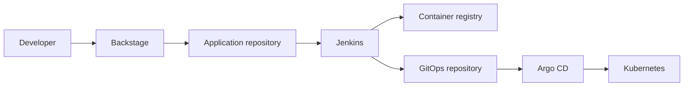

# TaxRakoto IDP

A ready-to-use Internal Developer Platform for an existing Kubernetes cluster,
built with Backstage, Jenkins, Argo CD, and Helm.

The project demonstrates how a platform team can provide one developer portal
and an automated path from service creation to deployment.

## What it provides

- **Backstage** for the software catalog, documentation, and service creation
- **Jenkins** for reusable continuous-integration pipelines
- **Argo CD** for automated GitOps delivery and drift reconciliation
- **Helm** for consistent application and platform deployments
- **Software Templates** that create platform-ready application repositories



## Start here

Read the [platform overview](https://github.com/taxrakoto-idp/platform), or
install the project by cloning the public
[argo repository](https://github.com/taxrakoto-idp/argo):

```bash
git clone https://github.com/taxrakoto-idp/argo.git
cd argo
./bootstrap-argocd.sh
```

No GitHub credentials or SSH key are needed to read the public GitOps
repositories.

## Repositories

| Repository | Responsibility |
| --- | --- |
| [`platform`](https://github.com/taxrakoto-idp/platform) | Main documentation, architecture, and installation guide |
| [`argo`](https://github.com/taxrakoto-idp/argo) | Argo CD installation and GitOps bootstrap |
| [`deploy`](https://github.com/taxrakoto-idp/deploy) | Helm charts and desired Kubernetes state |
| [`backstage`](https://github.com/taxrakoto-idp/backstage) | Backstage application, catalog, and integrations |
| [`templates`](https://github.com/taxrakoto-idp/templates) | Backstage Software Templates and skeletons |
| [`jenkins`](https://github.com/taxrakoto-idp/jenkins) | Jenkins Configuration as Code and shared library |

> The project installs onto a cluster supplied by the user. Kubernetes cluster
> provisioning is intentionally outside its scope.

## Status

This portfolio project is under active development. Each repository documents
which capabilities are implemented and which remain on the roadmap.
