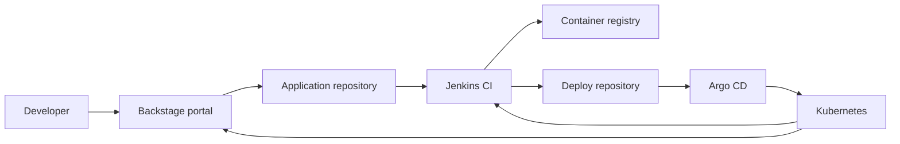

# TahinaRakoto-IDP

This organization hosts an Internal Developer Platform built around
[Backstage](https://backstage.io/), [Jenkins](https://www.jenkins.io/), and
[Argo CD](https://argo-cd.readthedocs.io/). Backstage provides the developer
portal, Jenkins builds and tests applications, and Argo CD continuously delivers
the desired state to Kubernetes.

## Platform overview



The intended delivery flow is:

1. A developer discovers or creates a service through Backstage.
2. Jenkins validates the source, builds the container image, and publishes it
   to the configured registry.
3. The deployment version is recorded in the GitOps repository.
4. Argo CD detects the change and reconciles the Kubernetes cluster.
5. Backstage exposes the service, ownership, documentation, and operational
   links through a single developer-facing portal.

## Organization repositories

| Repository | Responsibility |
| --- | --- |
| `backstage` | Backstage application, software catalog, plugins, and portal configuration |
| `templates` | Backstage Software Templates and their skeleton projects |
| `jenkins` | Jenkins Configuration as Code, pipelines, and shared libraries |
| `argo` | Argo CD installation, AppProjects, ApplicationSets, and GitOps bootstrap |
| `deploy` | Helm charts and environment-specific desired state watched by Argo CD |

Kubernetes cluster provisioning is intentionally outside the scope of this
organization.

## GitOps layout

The `deploy` repository separates reusable application charts from platform
tools:

```text
deploy/
├── apps/
│   └── react-chart/
│       ├── Chart.yaml
│       ├── values.yaml
│       ├── templates/
│       └── envs/
│           └── <environment>/
│               └── <application>/
│                   └── values.yaml
└── tools/
    ├── backstage/
    └── jenkins/
```

Application values must use this exact convention:

```text
apps/react-chart/envs/<environment>/<application>/values.yaml
```

For example, `apps/react-chart/envs/staging/my-first-react-app/values.yaml`
generates:

| Resource | Name |
| --- | --- |
| Argo CD Application | `my-first-react-app-staging` |
| Helm release | `my-first-react-app` |
| Kubernetes namespace | `my-first-react-app-staging` |

Every direct child of `tools/` must be a valid Helm chart. Its directory name
becomes both the Argo CD Application name and the Kubernetes namespace.

## Getting started

### Prerequisites

- Access to an existing Kubernetes cluster
- `kubectl` configured for the target cluster
- Helm 3
- An SSH key with read access to the private `argo` and `deploy` repositories

### Bootstrap Argo CD

From the `argo` repository, run:

```bash
./bootstrap-argocd.sh --ssh-key /path/to/github-key
```

To select a Kubernetes context explicitly:

```bash
./bootstrap-argocd.sh \
  --context kubernetes-admin@kubernetes \
  --ssh-key /path/to/github-key
```

The bootstrap installs Argo CD, registers the Git repositories, and applies the
root Application. Argo CD then creates the application and tool deployments
defined by the `deploy` repository.

Verify the result:

```bash
kubectl get applications,applicationsets,appprojects --namespace argocd
```

For more detail, see the documentation in the `argo` and `deploy` repositories.

## Contributing

- Keep application source, CI configuration, and deployment configuration in
  their owning repositories.
- Validate Helm changes with `helm lint` and `helm template` before opening a
  pull request.
- Use pull requests for changes to protected branches.
- Never commit passwords, tokens, SSH keys, kubeconfigs, or plain-text
  production secrets.
- Prefer an external secret manager and reference secrets from Helm values.
- Document ownership and operational links in the Backstage catalog metadata.

## GitOps safety

Argo CD is configured with automatic synchronization, pruning, and self-healing.
Removing an application values file or a tool chart can delete its generated
Application and Kubernetes resources. Review GitOps deletions carefully before
merging them.

## Project status

This platform is under active development. The current repository set contains
the Argo CD bootstrap and the shared application deployment chart; Backstage and
Jenkins are the core platform services being integrated into the GitOps flow.

