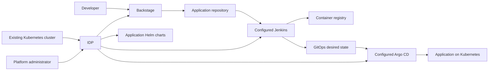

# TahinaRakoto-IDP

This project installs a ready-to-use Internal Developer Platform on an
existing Kubernetes cluster. It combines
[Backstage](https://backstage.io/), [Jenkins](https://www.jenkins.io/),
[Argo CD](https://argo-cd.readthedocs.io/), and reusable Helm charts into one
integrated platform.

The goal is to let a platform administrator provide a Kubernetes cluster and
receive a working developer portal and delivery workflow without having to
assemble and configure every component independently.

## What the project provides

- A ready-to-use Backstage developer portal hosted on Kubernetes
- A configured Jenkins instance for application build and test pipelines
- Argo CD configured for automated GitOps delivery
- Reusable Helm charts for deploying applications consistently
- Backstage Software Templates for creating services with the required source,
  CI, and deployment configuration
- A shared workflow connecting service creation, continuous integration,
  container publishing, and Kubernetes deployment

Cluster provisioning is not part of the project. Users provide an accessible
Kubernetes cluster; the project installs and configures the platform on it.

## Platform overview



Once installed, the intended developer workflow is:

1. A developer discovers or creates a service through Backstage.
2. Jenkins validates the source, builds the container image, and publishes it
   to the configured registry.
3. The deployment version is recorded in the GitOps repository.
4. Argo CD detects the change and reconciles the Kubernetes cluster.
5. Backstage exposes the service, ownership, documentation, and operational
   links through a single developer-facing portal.

## Organization repositories

| Repository | Responsibility |
| --- | --- |
| `backstage` | Backstage application, software catalog, plugins, and portal configuration |
| `templates` | Backstage Software Templates and their skeleton projects |
| `jenkins` | Jenkins Configuration as Code, pipelines, and shared libraries |
| `argo` | Argo CD installation, AppProjects, ApplicationSets, and GitOps bootstrap |
| `deploy` | Helm charts and environment-specific desired state watched by Argo CD |

## GitOps layout

The `deploy` repository separates reusable application charts from platform
tools:

```text
deploy/
├── apps/
│   └── react-chart/
│       ├── Chart.yaml
│       ├── values.yaml
│       ├── templates/
│       └── envs/
│           └── <environment>/
│               └── <application>/
│                   └── values.yaml
└── tools/
    ├── backstage/
    └── jenkins/
```

Application values must use this exact convention:

```text
apps/react-chart/envs/<environment>/<application>/values.yaml
```

For example, `apps/react-chart/envs/staging/my-first-react-app/values.yaml`
generates:

| Resource | Name |
| --- | --- |
| Argo CD Application | `my-first-react-app-staging` |
| Helm release | `my-first-react-app` |
| Kubernetes namespace | `my-first-react-app-staging` |

Every direct child of `tools/` must be a valid Helm chart. Its directory name
becomes both the Argo CD Application name and the Kubernetes namespace.

## Installation overview

### Prerequisites

- Access to an existing Kubernetes cluster
- `kubectl` configured for the target cluster
- Helm 3
- An SSH key with read access to the private `argo` and `deploy` repositories

### Bootstrap the GitOps foundation

From the `argo` repository, run:

```bash
./bootstrap-argocd.sh --ssh-key /path/to/github-key
```

To select a Kubernetes context explicitly:

```bash
./bootstrap-argocd.sh \
  --context kubernetes-admin@kubernetes \
  --ssh-key /path/to/github-key
```

The bootstrap installs Argo CD, registers the Git repositories, and applies the
root Application. Argo CD then installs and manages the platform components and
application deployments defined by the `deploy` repository.

Verify the result:

```bash
kubectl get applications,applicationsets,appprojects --namespace argocd
```

For more detail, see the documentation in the `argo` and `deploy` repositories.

## Contributing

- Keep application source, CI configuration, and deployment configuration in
  their owning repositories.
- Validate Helm changes with `helm lint` and `helm template` before opening a
  pull request.
- Use pull requests for changes to protected branches.
- Never commit passwords, tokens, SSH keys, kubeconfigs, or plain-text
  production secrets.
- Prefer an external secret manager and reference secrets from Helm values.
- Document ownership and operational links in the Backstage catalog metadata.

## GitOps safety

Argo CD is configured with automatic synchronization, pruning, and self-healing.
Removing an application values file or a tool chart can delete its generated
Application and Kubernetes resources. Review GitOps deletions carefully before
merging them.

## Project status

This platform is under active development. The Argo CD bootstrap and shared
application Helm chart are available. The complete one-step installation and
the ready-to-use Backstage and Jenkins configurations are being integrated into
the GitOps workflow.
